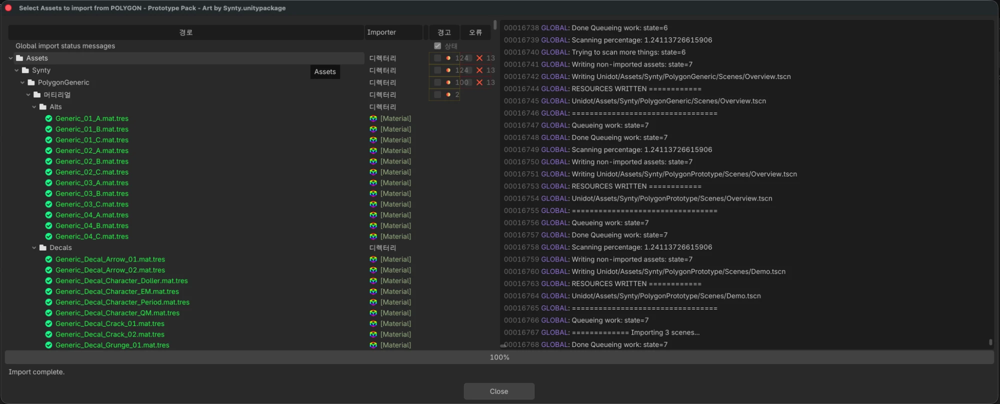
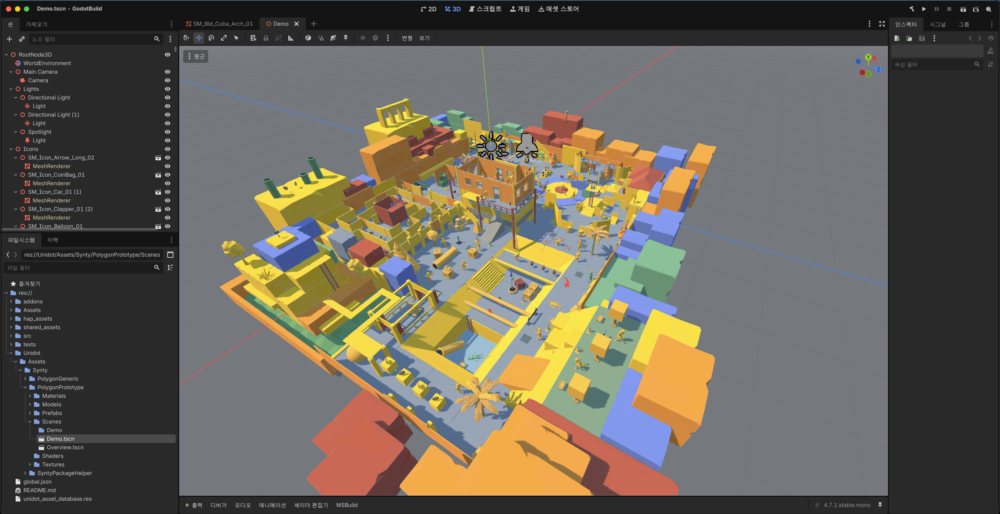

# Unidot Importer (한국어)

*Read this in [English](./README.md).*

**Unidot**은 Unity 소스 에셋을 Godot 4 네이티브 형식으로 번역하는 에셋 상호운용
파이프라인입니다. `.unitypackage` 파일과 에셋 폴더를 Godot 4.x 호환 형식으로 변환합니다.

원본 **소스 에셋**을 Godot 네이티브 등가물로 *번역*합니다. 예를 들어 `.unity`와
`.prefab`은 `.tscn`과 `.prefab.tscn`이 됩니다. 메시·애니메이션·머티리얼 등의 원시
에셋은 Godot `.tres`/`.res` 등가물로 직접 변환됩니다.

번역기이므로 작업이 끝나면 프로젝트에서 안전하게 제거할 수 있습니다
(`runtime/anim_tree.gd` 제외).

이 문서는 **HDNua fork 전용 한국어판**입니다. Unidot 본체의 전체 기능 목록, 지원
에셋 타입, 문제 해결, 알려진 이슈, 향후 계획은 영어 원문
[README.md](./README.md)를 참고하세요.

## 빠른 링크

- [업데이트 확인: https://unidotengine.org/](https://unidotengine.org)
- [문서: https://docs.unidotengine.org/](https://docs.unidotengine.org)
- [Discord 커뮤니티](https://discord.gg/JzXkxMRd9x) — 도움 요청, 성과 공유, 피드백

## 시스템 요구사항

Unidot은 Windows, macOS, Linux에서 테스트되었습니다. Godot 에디터 4.0~4.2를
지원하며, Godot 4.7.1에서 호환성 스모크 테스트를 거쳤습니다.

`.unitypackage` 임포트 시 FBX를 glTF로 자동 변환하는 데 FBX2glTF를 사용합니다.
이 fork의 검증은 Godot 네이티브 FBX 임포터로 수행했습니다.
[FBX2glTF 실행 파일을 내려받아](https://github.com/godotengine/FBX2glTF/releases)
Godot 에디터 설정에서 FBX Import를 구성한 뒤 사용하세요.

## 설치

1. 이 저장소를 프로젝트의 `addons/unidot_importer`에 배치합니다.
2. 프로젝트 설정 → 플러그인에서 **Unidot Importer**를 활성화합니다.
3. 메뉴의 Unidot 항목에서 `.unitypackage` 또는 에셋 폴더를 선택해 임포트합니다.

### 임포트 대상 경로

임포트 대화상자에서 출력 루트를 지정할 수 있습니다. 지정하지 않으면 패키지의
원본 경로 구조가 프로젝트 루트에 그대로 재현됩니다. 이 fork의 검증은
`res://Unidot`을 출력 루트로 사용했습니다.

## HDNua 업데이트

### 검증한 패키지

| 퍼블리셔 | 패키지 | 검증 환경 | 지원 | 리포트 |
| --- | --- | --- | :---: | --- |
| Synty Studios | POLYGON - Prototype Pack | Godot `4.7.1-stable.mono`, macOS | △ 부분 지원 | [상세](./docs/packages/polygon-prototype.md) |
| Synty Studios | POLYGON - Starter Pack | Godot `4.7.1-stable.mono`, macOS | △ 부분 지원 | [상세](./docs/packages/polygon-starter.md) |

각 패키지는 `tools/validate_package.py`가 만들어주는 일회용 프로젝트에서 따로
검증합니다. 리포트 작성 방법과 무엇을 분리해야 하는지는
[docs/packages/](./docs/packages/README.md)에 있습니다.

여러 패키지를 한 프로젝트에 임포트하는 것은 별개의, 순서에 의존하는 경우입니다. 두
패키지가 같은 Unity GUID를 서로 다른 내용으로 실으면 **나중에 임포트한 쪽이 파일을
대체**하며, 먼저 변환된 콘텐츠가 대체본에 없는 부분을 참조하고 있었다면 그 부분을 잃습니다.
이는 Unidot이 아니라 패키지 쪽 성질이고, 어느 버전이 의도된 것인지는 아카이브 어디에도
적혀 있지 않습니다. 임포트 전에 무엇이 충돌할지는
`tools/checks/package_overlap.py`가 알려주며, 실측 사례는
[Several packages in one project](./docs/packages/multi-package.md)에 있습니다.

`△ 부분 지원`은 검증된 사용 가능 부분집합이 존재하지만 임포트가 무손실은 아니며,
아래 격차에 대해서는 검토나 수동 이식이 필요하다는 뜻입니다. 상태가 `△`로 남는 이유는
ShaderGraph 콘텐츠가 아예 번역되지 않기 때문이지, 변환된 지오메트리가 미덥지 못해서가
아닙니다.

패키지별 리포트는 영어로만 작성합니다. 검증 수치가 갱신될 때 두 언어를 따로 관리하면
금방 어긋나기 때문입니다.

### 무엇이 변환되는가

| 영역 | 상태 | 비고 |
| --- | :---: | --- |
| 메시·트랜스폼·프리팹/씬 계층 | ○ 변환됨 | |
| 머티리얼과 albedo 텍스처 | ○ 변환됨 | `_Albedo_Map`, `_Base_Map`, `_Normal_Map`, `_Emission_Map`처럼 언더스코어가 붙은 Unity 텍스처 속성을 인식하며, mask·normal·metallic·roughness·emission 텍스처가 일반 albedo 폴백으로 선택되는 것을 방지 |
| 콜리전 셰이프 | ○ 변환됨 | |
| GameObject active 상태와 렌더러 가시성 | ○ 변환됨 | 메시가 공유 `Skeleton3D` 아래로 지연되는 경우에도 렌더러의 `m_Enabled`와 소스 GameObject의 active-in-hierarchy 상태를 결합 |
| 휴머노이드 리그와 스키닝 | ○ 변환됨 | Unity 아바타가 구조적으로 잘못된 리그, 양손에 본 이름이 중복되는 리그 포함 |
| 씬 루트 순서 | ○ 변환됨 | |
| 라이트맵 저작 값 | ○ 변환됨 | 리얼타임 GI 의도는 메타데이터로만 유지 |
| ParticleSystem | △ 부분 | 결정적 공통 부분집합만 변환. 그 밖의 활성 모듈은 명시적 경고 |
| 리얼타임 GI | ✗ 미변환 | Godot `LightmapGI`에 대응되는 리얼타임 기능 없음 |
| ShaderGraph / SubGraph | ✗ 미변환 | 수동 이식용 소스로 보존. 시맨틱은 번역되지 않음 |

각 항목의 근거 수치는 해당 패키지 리포트에 있습니다.

### 임포트 진단 메시지 해설

Synty 패키지를 임포트하면 엔진 레벨 `ERROR` 줄이 대량으로 출력되고 Unidot
다이얼로그의 경고·오류 카운터도 0이 아닙니다. **이는 정상이며, 그 자체로 변환이
실패했거나 잘못되었다는 뜻이 아닙니다.** 지금까지 관측된 진단은 모두 아래 네 가지
분류에 들어가며, 그중 셋은 변환이 아니라 소스 패키지 쪽 결함입니다.

*정상 임포트 화면입니다. `Import complete.`와 함께 경고·오류가 카운터에 남아 있습니다.
POLYGON Prototype 리포트가 그 전부를 하나도 빠짐없이 설명합니다.*

**1. 벤더의 FBX에 박제된 죽은 텍스처 경로.** Godot 콘솔의 수천 줄짜리 빨간 `ERROR`가
전부 여기서 나옵니다. Synty 아티스트가 자기 작업용 텍스처(`.psd`, `.tif`, 원본 `.png`)를
꽂은 채로 FBX를 익스포트했고, 개인 작업 폴더 경로는 물론 `C:/Users/<아티스트>/Downloads/...`
같은 경로까지 FBX 내부에 그대로 저장되어 배포되었습니다. 정작 그 파일들은
`.unitypackage`에 들어 있지 않고 병합된 런타임 `.png` 아틀라스만 포함됩니다. Unity에서
드러나지 않는 이유는 Unity가 FBX 내장 머티리얼 참조를 무시하고 `.mat` 에셋의 GUID로
텍스처를 연결하기 때문입니다. Godot의 FBX 파서는 더 곧이곧대로라서 내장 경로를 하나씩
해석해보고 실패하면 그대로 보고합니다. 무해한 이유는 Unidot도 FBX 내장 머티리얼을
신뢰하지 않기 때문입니다 — Unity `.mat` 에셋을 변환해서 임포트 이후에 직접 할당합니다.

**2. 패키지가 애초에 깨진 채로 배포한 참조.** 프리팹이 메시·텍스처·스크립트 GUID를
참조하는데 그 GUID를 소유한 `.meta`가 패키지에 없는 경우가 있습니다. Unity에서도 이미
깨져 있는 참조입니다. Unidot은 이를 구조화된 소스 데이터 실패로 한 번씩만 보고하고,
해당 컴포넌트만 건너뛴 뒤 나머지는 정상 변환합니다. 다이얼로그의 빨간 오류 카운터를
채우는 것이 이 분류입니다.

**3. 기능 격차 통지.** Unity 기능에 대응되는 Godot 기능이 없는 경우 — 대부분의
ParticleSystem 모듈, ShaderGraph 시맨틱, 리얼타임 GI, Godot 지원 범위를 벗어난 라이트맵
값 — Unidot은 가능한 만큼 변환하고 근사하거나 건너뛴 부분을 명시적으로 경고합니다.
경고 카운터의 대부분이 이 분류입니다.

**4. Unidot 자신의 검증기가 무언가를 잡았다는 보고.** 휴머노이드 본맵 검증기는 구조적으로
잘못된 Unity 아바타를 거부하고 자동 본 매핑으로 폴백할 때 경고를 남기고, `Root` 가드는
기존 프로파일 매핑 덮어쓰기를 거부할 때 경고를 남깁니다. 이 경고가 보인다는 것은
방어 장치가 작동했다는 뜻입니다.

패키지 탓도 Unidot 탓도 아닌 진단이 딱 하나 있습니다. [알려진 한계](#알려진-한계)를
참고하세요.

### Unidot이 방어하는 소스 데이터 결함

Unity의 휴머노이드 아바타는 애니메이션 리타게팅에만 쓰이고, Unity는 씬을 원본 리그
트랜스폼으로 직접 그립니다. 그래서 잘못 만들어진 아바타는 Unity에서 보이지 않지만,
그 아바타를 믿고 스켈레톤을 재구성하는 임포터는 메시를 붕괴시킵니다. Unidot은
`humanDescription` 본맵을 리그 계층과 대조해 검증하며(매핑된 각 본의 가장 가까운 매핑된
조상은 `SkeletonProfileHumanoid`상에서도 그 본의 조상이어야 함), 구조적으로 모순된 맵이면
자동 휴머노이드 본 매핑으로 폴백하고 그 사실을 경고로 남깁니다. `Hips`가 아예 없는 맵도
같은 방식으로 거부합니다.

POLYGON Prototype 팩이 정확히 그런 아바타를 담고 있습니다.
[패키지 리포트](./docs/packages/polygon-prototype.md#source-data-defect-the-synty-humanoid-avatar)에
수정 전후 렌더를 포함한 사례 전체가 정리되어 있습니다.

### 알려진 한계

`△ 부분 지원` 상태는 의도된 것입니다. ShaderGraph/SubGraph 파일은 Godot 셰이더로
변환되지 않고 수동 이식용 소스로 보존됩니다. ParticleSystem 변환은 결정적으로 대응
가능한 공통 부분집합만 다루며, Rotation·Noise·Velocity·ClampVelocity·UV
애니메이션·Collision·burst 및 일부 형상·빌보드 모드는 생략되거나 근사되고 그때마다
명시적 경고를 남깁니다. Unity 리얼타임 GI도 Godot 리얼타임 GI로 변환되지 않습니다.
active-state 검증은 직렬화된 기본 GameObject·렌더러 상태를 다루며, active 상태를
토글하는 임의의 프리팹 오버라이드는 아직 어떤 패키지 픽스처로도 검증되지 않았습니다.

패키지 탓도 Unidot 탓도 아니며 Unidot이 고칠 수도 없는 결함이 하나 있습니다. Godot의
FBX 임포터는 FBX에 내장된 텍스처 참조를 후보 디렉터리를 훑어가며 해석하는데, 그 후보
중에 소문자 `textures/`가 있습니다. 대소문자를 구분하지 않는 파일시스템에서는 이 탐색이
`Textures/`에 저장된 파일을 열어버리고, Godot이 대소문자 불일치 경고를 낸 뒤 요청한 표기가
그대로 추출 메시에 기록됩니다. 그 참조는 대소문자를 구분하는 파일시스템으로 익스포트하면
로드되지 않습니다. 변환된 `.mat` 리소스는 영향이 없으므로 프리팹과 씬은 정상
렌더링됩니다. Unidot은 post-import 스크립트에서 이 참조를 고칠 수 없습니다 — 해당 `.mesh`
파일을 Unidot이 쓰긴 하지만, 그 뒤에 Godot 자신의 `save_to_file` 서브리소스 추출이 같은
경로를 다시 쓰기 때문에 post-import에서 한 수정은 덮어써집니다. 제대로 고치려면 엔진의
텍스처 탐색 규칙이나 모델 `.import` 설정의 메시 추출 방식을 바꿔야 합니다.

Unidot 로그의 빨간 오류 카운터는 진단 메시지 개수이지, 실패한 파일이나 씬의 개수가
아닙니다. 씬은 정상적으로 로드되면서 그 안의 미지원 컴포넌트나 오버라이드만 건너뛸 수
있습니다.

이는 위에 나열된 패키지와 설정에 대한 호환성 결과이며, 모든 Synty 패키지나 모든 Unity
기능이 완전히 지원된다는 주장이 아닙니다. 커스텀 ShaderGraph/SubGraph, MonoBehaviour,
고급 ParticleSystem, 리얼타임 GI, 외부 참조가 누락된 소스 에셋은 여전히 수작업이 필요할
수 있습니다.

