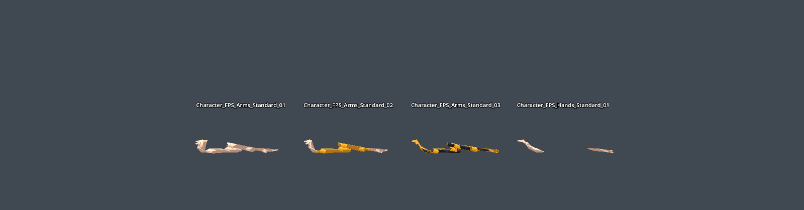
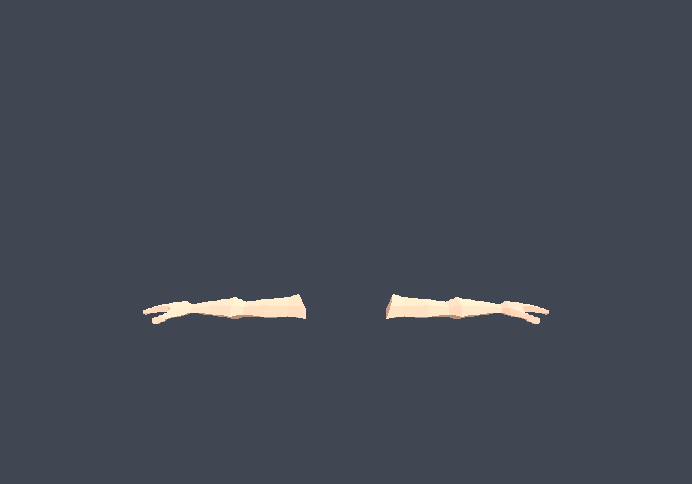
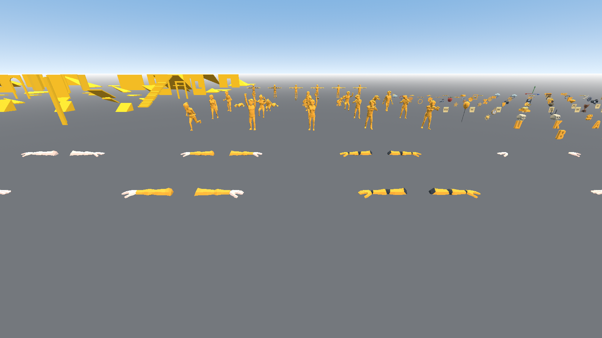

# Unidot Importer

*Read this in [한국어](./README.ko.md).*

Unify your Godot asset interop with **Unidot**, a **Uni**versal Go**dot** Engine source asset translator and interoperability pipeline for Godot 4.

At its heart, Unidot Importer can convert `.unitypackage` assets and asset folders into Godot 4.x compatible formats.

It takes original **source assets** and *translates* them into Godot native equivalents.
For example, `.unity` and `.prefab` become `.tscn` and `.prefab.tscn`.

FBX Files are currently ported to glTF but this may be made more flexible in the future.

Raw mesh, anim, material assets and more are converted directly to godot `.tres/.res` equivalents.

Due to being a translator, Unidot may safely be removed from the project when completed. (other than `runtime/anim_tree.gd`)

## Quick links

- [Follow updates at https://unidotengine.org/](https://unidotengine.org).
- [Read documentation at https://docs.unidotengine.org/](https://docs.unidotengine.org).
- [Join our community on Discord](https://discord.gg/JzXkxMRd9x) for help, to share success or feedback.

## Made for Godot Engine 4

We rely on automatic FBX to glTF translation during `.unitypackage` import using FBX2glTF. [please download the FBX2glTF exe](https://github.com/godotengine/FBX2glTF/releases) and configure FBX Import in Godot Editor Settings before using Unidot.

Please use a version of Godot 4.0 or later with FBX2glTF configured in Editor Settings to run this addon.

## System requirements:

Unidot has been tested on Windows, macOS and Linux versions. It supports Godot Editor versions 4.0 through 4.2, with compatibility smoke-tested on Godot 4.7.1.

Unidot recommends a system with at least 16GB of RAM for many assets. It is uncommon for large imports to take more than 10-12GB.

Due to pre-caching of assets in memory, it is okay if some data is swapped to disk with virtual memory, especially in large imports of thousands of files..

## Installation:

1. This repository should be imported at `addons/unidot_importer` in the project, such as using git submodule or unzipping.
   * Note that `runtime/anim_tree.gd` will be referenced by scenes and should be kept even if the rest of unidot is removed.
2. Enable the Unidot Importer plugin in `Project Settings -> Plugins tab -> Unidot`
3. Unidot requires an installation of FBX2glTF from https://github.com/godotengine/FBX2glTF/releases and set in the FBX2glTF.exe path in the Import category of **Editor Settings** (not Project Settings)
4. To add TIFF / .tif and PSD / .psd support, install [ImageMagick](https://imagemagick.org/) or [GraphicsMagick](http://www.graphicsmagick.org/) into your system path or copy convert.exe into this addon directory.
5. Access the importer through `Project -> Tools -> Import .unitypackage...` and select a package or an asset folder

### Import destination

The import dialog can place translated assets below a project-relative destination
without changing their Unity source paths. The default remains `res://` for
backward compatibility. For example, selecting `res://Unidot` maps:

```text
Assets/Example/Model.fbx -> res://Unidot/Assets/Example/Model.fbx
```

Projects may provide a default with the `unidot/import_output_root` project
setting. The destination must remain inside `res://`; absolute paths, `user://`,
backslashes, and relative `.` or `..` segments are rejected.
When a non-root destination is selected, fallback texture and material searches
are confined to that destination so existing project assets are not linked by
accident.
The importer assumes a trusted project tree and does not sandbox writes against
pre-existing symlinks or junctions inside the project.
The asset database keeps one active output path per Unity GUID, so importing the
same package into multiple destinations in one project is not supported.


Read more at our [documentation site](https://docs.unidotengine.org).

## Features

- `.unitypackage` importer and translation shim.
- Translates native filetypes (such as .unity or .mat) to Godot native scene or resource types.
- Animation and animation tree porting, including humanoid .anim format.
- Support for humanoid armatures, including from prefabs, unpacked prefabs and model import.
- Translates prefabs and inherited prefabs to native Godot scenes and inherited scenes.
- Supports both binary and text YAML encoding
- Implementation of an asset database by GUID

Note that scripts and shaders will need to be ported by hand. However, it will be possible to map scripts/shaders to Godot equivalents after porting.

## Supported asset types:

* Mesh/MeshFilter/MeshRenderer/SkinnedMeshRenderer
* Material (standard shader only)
* Avatar
* AnimationClip
* AnimatorController (relies on small runtime helper script `unidot_importer/runtime/anim_tree.gd`)
* AnimatorState/AnimatorStateMachine/AnimatorTransitionBase/BlendTree
* PrefabInstance (prefabs)
* GameObject/Transform/Collider/SkinnedMeshRenderer/MeshFilter/Animator/Light/Camera etc. (scenes)
* Texture2D/CubeMap/Texture2DArray etc.
* AssetImporter
* AudioClip/AudioSource
* Collider/Rigidbody
* Terrain (limited support for detail meshes as MultiMeshInstance)
* LightingSettings/PostProcessLayer

## Unsupported

* Shader: a system may someday be added to create mappings of equivalent Godot Engine shaders, but porting must be done by hand.
* MonoBehaviour (C# Script porting)
* AvatarMask (waiting for better Godot engine support)
* Canvas / UI is not implemented.
* PlayableDirector
* Anything not listed above

## Troubleshooting

* If an import fails, it is possible to view the logs of the most recently completed import.
	* Use `Project -> Tools -> Show last import logs`.
	* Click the yellow or red columns to see all errors in the project.
	* Or, click a Logs button on a file to see the entire log.
	* Clicking the Logs for Assets may take time to collect all logs in the project, but can be helpful for submitting a bug report.
	* The Godot console output may also be helpful if submitting a bug report.

* It would be good to double check that all dependencies imported, and then try again.

* If Godot crashes during an import, it may be good to try a smaller import.

* If importing a subset of files, import assets in the correct order: make sure to do materials after textures, and scenes after models / materials they may need.
  Using the shift key while selecting assets can ensure you include the needed depdencies.

* If models in a scene are looking corrupted, it may be due to the scene using unpacked prefabs. In this case, replacing them with the original converted ".gltf" should work.

## Known issues

- There may be large memory consumption in the earlier phases of the import process. Unidot will pre-parse most assets upfront in the "Preprocessing" stage.
  Additionally, Godot may read textures from disk while assigning materials.
- Due to memory constraints, large animation files currently import in the main thread.
	- This could cause Godot to hang or freeze for a long time in animation packs with a message such as "Importing 50 textures, animations and audio...".
- Reimporting animations after import can lose the correct track paths, since the animations are modified during scene import.
- Unidot does not indicate clearly when assets are missing GUID references. Models missing referenced data may not import correctly.
- Models missing UpperChest, Shoulder or Neck bones may animate incorrectly due to lack of missing bone compensation in Godot's Humanoid retargeter.
- Unpacked prefabs of humanoid models may malfunction due to the retargeting.
  Unidot does its best to correct these cases, but some models, especially those with rotated hips and scaled armature, may malfunction.
- non-weight-painted vertices currently go to skeleton origin instead of hips (bone index 0)
- FBX2glTF which is used to convert .fbx to .gltf has some rare bugs. These would currently affect all FBX imports into Godot Engine.
	- Some rare fbx models with ngons may be missing triangles.
	- Models using RotationPivots may not have the meshes centered at the pivot points,
	  which could impact content or animations that expect the correct pivots.
- Shift to select dependencies does not find all texture assets referenced by models.

## Future work

- Repacking unpacked avatar prefabs where possible
- Better support for attaching outfits to imported models.
  For example, if any skinned meshes are humanoid but missing animator or no avatar set,
  treat skeleton hierarchy as having humanoid avatar enabled from that model.
- Reduce the dependency on FBX conversion tools

## A final note:

This tool is designed to assist with importing or translating source assets made for use in the editor. It makes an assumption that (other than animator controllers) most yaml files contain only one object).

Unidot solely translates existing usable source assets into equivalent Godot source assets. There are no plans to add functionality for decompiling asset bundles or ripping game content. That is not the goal of this project.

# Join our community

- [Follow updates at https://unidotengine.org/](https://unidotengine.org).
- [Read documentation at https://docs.unidotengine.org/](https://docs.unidotengine.org).
- [Join our community on Discord](https://discord.gg/JzXkxMRd9x) for help, to share success or feedback.

# Thanks

it is only thanks to all of you in the community using and supporting the project,
and for the many contributors that Unidot released in the form it has today <3

Special Thanks to

* Cthulhoo for some incredibly useful testcases for various humanoid rigs and animations,
  and for their explanation and insight into how Root Motion works that allowed me to implement RM support.
* Stan for sending over some really cool gamejam projects filled with all sorts of different ways to reference prefabs.
* And quite a number of others who provided test assets or testing.
* The [V-Sekai community](https://github.com/V-Sekai) for all your support.
* The [V-Sekai team](https://v-sekai.org) for contributions and inspiration.


## HDNua update

### Asset support matrix

| Publisher | Package | Tested with | Support | Details |
| --- | --- | --- | :---: | --- |
| Synty Studios | POLYGON - Prototype Pack | Godot `4.7.1-stable.mono`, macOS | △ Partial | Everything that defines how the package looks and is laid out converts and is validated. Shader semantics and the advanced half of ParticleSystem do not convert. Broken down per area below. |

`△ Partial` means the package has a validated usable subset, but the import is
not lossless and still requires review or manual porting for the listed gaps.
The status stays `△` because ShaderGraph content is not translated at all — not
because the converted geometry is in doubt.

| Area | Status | Notes |
| --- | :---: | --- |
| Meshes, transforms, prefab and scene hierarchy | ○ Converted | `498/498` prefabs and scenes instantiate; `989/989` generated scene resources load |
| Materials and albedo textures | ○ Converted | `121` of `139` converted materials bind a texture; the other `18` carry none in the Unity source either |
| Collision shapes | ○ Converted | Except `13` colliders whose source mesh is missing from the package itself |
| GameObject active state and renderer visibility | ○ Converted | `8` visible / `24` hidden variants with `0` mismatches |
| Humanoid rigs and skinning | ○ Converted | `3,600` skin-deformation checks, `0` failures — see [Humanoid skinning correctness](#humanoid-skinning-correctness) |
| Scene root order | ○ Converted | Authored root order restored in the demo scene |
| Lightmap authoring values | ○ Converted | Bounces, mode, texel scale, and texture size preserved |
| ParticleSystem | △ Partial | The deterministic common subset converts; `108` warnings mark omitted or approximated modules |
| Realtime GI | ✗ Not converted | Godot `LightmapGI` has no realtime equivalent; Unity's intent is kept as metadata only |
| ShaderGraph and SubGraph | ✗ Not converted | All `25` files are preserved as source for manual porting; their semantics are not translated |

Every diagnostic printed during import is accounted for in
[Understanding the import diagnostics](#understanding-the-import-diagnostics),
and the residual defects are listed under [Known limitations](#known-limitations).

### Source-data defect: the Synty humanoid avatar

The FPS arm prefabs in this package collapsed on import, and the cause was
neither Unidot nor Godot — it is an error in the Synty asset's own avatar data.



*Before: the Standard FPS arm prefabs, torn apart by the bad avatar data.*

- `Character_FPSHands_01.fbx`, the model used by the Standard prefabs, ships a
  Unity avatar that maps `Hips → Root`, the rig root bone. That shifts the whole
  spine chain up by one level: `Spine ← Hips`, `Chest ← Spine_01`,
  `UpperChest ← Spine_02`, and `Spine_03` is left unmapped.
- `Character_FPSHands_02.fbx`, used by the FiveFinger prefabs, maps
  `Hips → Hips` and is correct. This is why the FiveFinger family always
  imported cleanly while the Standard family did not.

Why it looks fine in Unity: Unity uses the avatar mapping only for humanoid
animation retargeting, and draws the scene straight from the original rig
transforms. So a badly authored avatar is harmless in Unity, while Unidot
trusts that mapping and uses it to rebuild the skeleton — which is why the
breakage appears only in Godot. This is the point that was previously
misdiagnosed as an "engine problem". It is really a source-data defect, and one
the importer can defend against.

That defense now exists. Unidot validates a `humanDescription` bone map against
the rig hierarchy — every mapped bone's nearest mapped ancestor must also be its
ancestor in `SkeletonProfileHumanoid` — and falls back to automatic humanoid
bone mapping when the map is structurally inconsistent, logging a warning that
says so. A map with no `Hips` at all is rejected the same way.

### Humanoid skinning correctness

Revision `b60759d` closes the last known geometry defect for this package. The
converted FPS arm prefabs now reproduce the Unity source rig exactly: for every
one of the 8 arm prefabs, every bone, and every `Skin`, the skin deformation
`D = G_bone × bind` is the identity transform (translation < 1 cm, scale error
< 0.01, rotation < 1°, and adjacent-bone probe gaps < 1 cm) across `3,600`
checks, with `0` failures. Before the fix the same gate reported `256` failures,
all confined to the right arm chain.

Falling back to automatic bone mapping exposed two further defects, both
triggered by rigs that combine an incomplete auto-detected bone map with bone
names duplicated across both hands:

1. **Root hijack.** Humanoid `Root` discovery walked up from an arbitrary mapped
   bone and claimed the last unmapped ancestor it saw. When the auto-mapper left
   the clavicles unmapped, a walk starting from a right-hand finger claimed
   `Clavicle_R` as the profile `Root`. Its original orientation was then never
   recorded, which corrupted the pre-retarget rest chain — and therefore the
   rotation delta — of every bone below it by a constant 138.7°. The walk now
   rejects any candidate that still has a mapped bone above it, so only bones
   above the entire mapped rig (such as an `Armature` node) can become `Root`.
2. **Bone name space mismatch.** Prefab conversion looked bones up in the
   auto-detected map using Godot-sanitized skeleton names (`Finger_01_2`), while
   prefab GameObjects carry Unity's de-duplicated names (`Finger_01 1`). Every
   affected right-hand finger therefore lost both its humanoid mapping and its
   rotation delta. Lookups are now translated through
   `godot_sanitized_to_orig_remap`, and rotation deltas are aliased under the
   Unity names.

All three fixes ship with asset-independent synthetic regression tests, and the
full public test suite passes (`15/15`).


*After: the same four prefabs, same camera, with the fixes applied.*



*`Character_FPS_Arms_Standard_01` in close-up. The right arm — the one that used
to be twisted around the wrist axis — now mirrors the left.*



*The same result in context: the FPS arm rows of the package `Overview` scene,
rendered at runtime rather than in the editor, so no gizmos or RESET pose
overrides are in frame.*

### Understanding the import diagnostics

Importing this package prints a large number of engine-level `ERROR` lines and
shows non-zero warning and error counters in the Unidot dialog. **None of them
indicate a failed or incorrect conversion of POLYGON Prototype.** They were
classified message-by-message from an instrumented full import at revision
`b60759d`. The summary below is that classification.


*What a successful import of this package looks like: `Import complete.` with
`124` warnings and `13` errors still on the counters. The rest of this section
accounts for every one of them.*

**The thousands of red `ERROR` lines in the Godot console are dead texture
paths baked into the vendor's FBX files.** The Synty artists exported the FBX
files with their own working textures still assigned — `.psd`, `.tif`, and
source `.png` files living under their personal Dropbox working folders. Those
paths are stored verbatim inside the shipped FBX, but the files themselves are
not part of the `.unitypackage`; only the flattened runtime `.png` atlases are.
Unity never surfaces this because it ignores FBX-embedded material references
and binds textures through the `.mat` asset's GUID instead. Godot's FBX parser
is more literal: it resolves each embedded path, fails, and reports it. In one
full import this produced `10,736` engine `ERROR` lines and `3,916`
`FBX: Image index ... couldn't be loaded` warnings, referencing `2,576` `.psd`,
`1,324` `.png`, `12` `.tga`, and `4` `.tif` targets — `1,483` of which point at
artist working directories that were never shipped. Five further warnings are
case-mismatched folder names inside the package (`textures/` vs `Textures/`).

This is cosmetic because Unidot does not trust FBX-embedded materials in the
first place: it converts the Unity `.mat` assets and assigns them after import.
Verified on the converted output, `121` of `139` converted materials have a
real albedo texture bound; the remaining `18` are glass, water, glow, skybox,
blank, and FX materials that carry no texture GUID in the Unity source either.

**The `13` red errors in the Unidot dialog are a defect in the vendor package,
not in the conversion.** All `13` are the same message —
`Unable to create MeshCollider shape because the source mesh could not be resolved`
— raised by 13 POLYGON **Generic** prop prefabs (`SM_Gen_Prop_Sack_01` through
`_05`, `Sack_Stack_01`/`_02`, `Pot_04`/`_05`, `Potion_01`, `Rope_Knot_01`,
`Screen_01`, `Skull_01`). Each has a `MeshCollider` pointing at a collision-mesh
GUID that no `.meta` file anywhere in the Unity project owns, meaning the
reference is already broken in Unity. Unidot reports each one once as a
structured source-data failure, skips only the collision shape, and converts the
rest of the prefab normally. **POLYGON Prototype itself produces `0` errors.**

**The `124` dialog warnings are feature-gap notices, not damage.** The
distribution over the `152` raw warning records emitted during the run (the
dialog counts only the subset on assets selected for import, so `.cs` and
`.shader` assets are excluded) is:

| Count | Category |
| ---: | --- |
| `108` | ParticleSystem modules Godot has no equivalent for, or that are approximated (Rotation, Noise, ClampVelocity, Velocity, UV animation, Collision, emission bursts, stretched billboards, hemisphere and sphere-shell shapes, 3D start size/rotation) |
| `23` | ShaderGraph/SubGraph files preserved as source-only instead of translated |
| `9` | Stripped intermediate prefab transforms |
| `4` | Unity lightmap authoring values clamped into Godot's supported range |
| `3` | Heuristic main-object-id resolution |
| `3` | Humanoid bone-map validators reporting that they rejected a bad source avatar |
| `2` | Material references without a meta entry, loaded directly |

The three humanoid warnings are the importer's own defenses reporting success,
not problems: one is the `humanDescription` validator rejecting
`Character_FPSHands_01`'s structurally inconsistent Unity avatar described
above, and two are the guard that refuses to overwrite an existing profile
mapping with `Root`.

**Conclusion: for the Synty POLYGON Prototype package, this revision is a
correct Unity → Godot asset conversion.** Every diagnostic above is either a
defect in the source package that Unity also carries, or an explicit notice
about a Godot feature gap. None of them corresponds to a mesh, material,
transform, or skinning value that was converted incorrectly.

### Synty POLYGON Prototype validation details

The HDNua fork has been tested with the Synty **POLYGON - Prototype Pack**
`.unitypackage` on Godot `4.7.1-stable.mono` for macOS. The validated
configuration used the native Godot FBX importer, imported into
`res://Unidot`, and saved translated resources and scenes as text.

Validated results, originally collected with importer revision
`40f917184968c6193c81ebe3fa719a386ea86c1c` and re-confirmed at `b60759d`:

- The public synthetic regression suite passed (`15/15`), including dedicated
  GameObject active-hierarchy, deferred SkinnedMeshRenderer visibility,
  warning-severity, repeated missing-MeshCollider lookup, humanoid avatar bone
  map validation, humanoid `Root` discovery, and duplicate-bone-name prefab
  remap coverage.
- All `8` FPS arm prefabs passed the skin-deformation identity gate
  (`3,600` checks, `0` failures). See
  [Humanoid skinning correctness](#humanoid-skinning-correctness).
- `2,291` package assets selected and `5,944` output files generated.
- All `496` POLYGON Prototype prefabs and `2` regular scenes loaded and
  instantiated (`498/498`).
- All `13` expected representative albedo texture mappings matched (`13/13`).
- The POLYGON Prototype validation found `0` missing mesh, material, or
  collision-shape bindings.
- All `989` generated Synty `.tscn` resources from the package loaded and
  instantiated, including POLYGON Generic and POLYGON Prototype content. This
  is a structural load gate, not a semantic-parity or lossless-conversion claim.
- All `8` FPS/VR hand prefabs preserved the intended active SkinnedMesh variant:
  `32` variants produced exactly `8` visible and `24` hidden meshes with `0`
  mismatches. Instantiating the package `Overview.tscn` produced the same
  `8/24` result. The importer now combines the renderer's `m_Enabled` state
  with its source GameObject's active-in-hierarchy state even when the mesh is
  deferred under a shared Godot `Skeleton3D`.
- All `30` Unity ParticleSystem/ParticleSystemRenderer pairs generated
  `GPUParticles3D` nodes. The common Initial, Emission, Shape, Color, Size,
  billboard, stretched-billboard, and mesh-renderer subset is converted;
  enabled unsupported modules produce explicit warnings.
- Unity `SceneRoots` restored the authored root order in the demo scene.
- The package LightingSettings asset generated a Godot resource, and the demo
  `LightmapGI` preserved the mapped authoring values (`2` bounces, directional
  mode, `0.025` texel scale, and `2048` maximum texture size). Unity realtime-GI
  intent is metadata-only because Godot `LightmapGI` has no equivalent realtime
  conversion.
- All `25` ShaderGraph/SubGraph files were preserved as source-only files and
  no `.failed_import` files were generated. Their shader semantics were not
  translated.
- This full-import run observed warning diagnostics decrease from the `667`
  baseline to `141`, while failure diagnostics remained at `13`. A preceding
  equivalent run collected `140`; the one-message variation was in concurrent
  source-only shader warning collection, while the `25/25` source-preservation
  gate was unchanged. The `b60759d` re-run counted `124` dialog warnings and the
  same `13` failures, from `152` raw warning records and `26` raw failure
  records; the difference between the raw and dialog counts is the `.cs` and
  `.shader` assets that are deselected from import by default.
- Targeted non-actionable warning noise was `0`: disabled-animation
  `AnimationClip` fallback IDs and identity Humanoid rotations are retained only
  in verbose diagnostics, while repeated missing-MeshCollider lookups no longer
  emit duplicate generic no-meta warnings.
- The remaining warnings are actionable or explicitly lossy diagnostics, and are
  broken down per category in
  [Understanding the import diagnostics](#understanding-the-import-diagnostics).
- The `13` red diagnostics are all for POLYGON Generic MeshColliders whose
  referenced source mesh GUID/fileID is absent from the package. Each missing
  reference is reported once as a structured source-data failure instead of a
  null-mesh script error. The referenced GUIDs are owned by no `.meta` file
  anywhere in the Unity project, so the references are already broken in Unity.

The material mapping update recognizes underscored Unity texture properties
such as `_Albedo_Map`, `_Base_Map`, `_Normal_Map`, and `_Emission_Map`, while
preventing mask, normal, metallic, roughness, and emission textures from being
selected as generic albedo fallbacks.

### Known limitations

The `△ Partial` status is intentional. ShaderGraph/SubGraph files are preserved
for manual porting, not converted to Godot shaders. ParticleSystem conversion
covers the common deterministic subset; modules such as Rotation, Noise,
Velocity, ClampVelocity, UV animation, Collision, bursts, and some shape or
billboard modes are omitted or approximated with explicit warnings. Unity
realtime GI is also not converted to a Godot realtime-GI system.
The active-state validation above covers the package's serialized base
GameObject and renderer states; arbitrary prefab overrides that toggle active
state are not yet covered by this package fixture.

One diagnostic is a genuine defect that Unidot cannot correct. Godot's FBX
importer resolves an embedded texture reference by probing candidate
directories, and one of those probes is a lowercase `textures/`. On a
case-insensitive filesystem that probe opens a file stored as `Textures/`,
Godot warns about the case mismatch, and the requested spelling is what gets
written into the extracted mesh. In this package that affects exactly one
texture (`Generic_Road_01.png`) across `23` files under `Models/extracted/`,
which would fail to load if the project were exported to a case-sensitive
filesystem. The converted `.mat` resources are unaffected, so prefabs and
scenes render correctly. Unidot cannot repair the stored reference from its
post-import script: it writes those `.mesh` files, but Godot's own
`save_to_file` subresource extraction rewrites the same paths afterwards, so
any correction made during post-import is overwritten. Fixing it properly
requires a change in the engine's texture probe or in how the model `.import`
configuration extracts meshes.

The red error counter in the Unidot log is a count of diagnostic messages, not
a count of unique failed files or failed scenes. A scene can load successfully
while an unsupported component or override inside it was skipped. In
particular, the deeper albedo and missing-binding checks above are scoped to the
`498` POLYGON Prototype prefabs and scenes; the `989/989` check only establishes
that every generated scene resource can be loaded and instantiated. In this
validation run, the remaining `13` red diagnostics are the source-missing
POLYGON Generic collider references described above.

This is a compatibility result for this package and configuration, not a claim
that every Synty package or every Unity feature is fully supported. Custom
ShaderGraph/SubGraph content, MonoBehaviours, advanced ParticleSystems,
realtime GI, and source assets with missing external references may still
require manual work.


